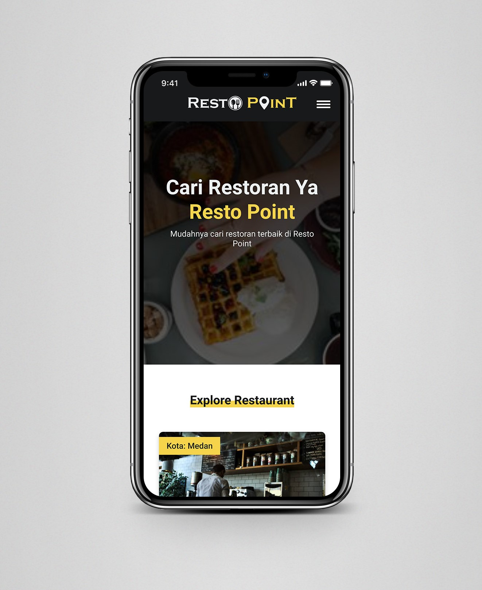

# Resto Point Lite-PWA

Simple Restaurant PWA apps with dummy data

#### Check this website [Resto Point Lite](https://fachrul-covid19web.netlify.app/).

## Description
This website built with:
* HTML
* CSS
* Webpack
* Workbox-webpack-plugin
* Idb

## Run Local
* Clone this repo:

`$ git clone https://github.com/Fachrulmustofa20/RestaurantApp-PWA.git`

* Install dependencies

`$ npm install`

#### Development
`$ npm run start-dev`

#### Production
`$ npm run build`

#### Testing
`$ npm run test`
`$ npm run e2e`

### API:
<a href="https://github.com/mathdroid/indonesia-covid-19-api">Dicoding Restaurant</a>
